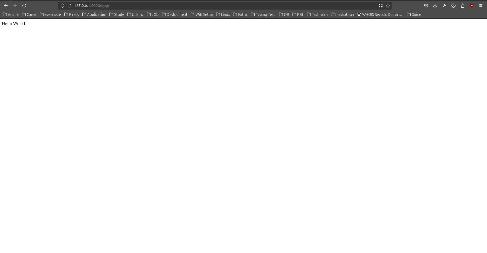

# 🌟 Internship Report

## 📋 Overview

This report documents my progress and tasks completed during my internship, including links to resources utilized and the status of various tasks.

---

## 📅 Daily Log

| **Day** | **Date**    | **Title**                                     |
| ------- | ----------- | --------------------------------------------- |
| Day 1   | 1-OCT-2024  | Setting Up Development Environment            |
| Day 2   | 2-OCT-2024  | Introduction to Python Basics                 |
| Day 3   | 3-OCT-2024  | Learning Python Data Structures               |
| Day 4   | 4-OCT-2024  | Building Simple Python Projects               |
| Day 5   | 5-OCT-2024  | Diving into Django Framework                  |
| Day 6   | 6-OCT-2024  | Creating a Basic Django Project               |
| Day 7   | 7-OCT-2024  | Understanding Django Models                   |
| Day 8   | 8-OCT-2024  | Exploring Django Views and Templates          |
| Day 9   | 9-OCT-2024  | Continued SQL Learning (Holiday)              |
| Day 10  | 10-OCT-2024 | Continued SQL Learning (Holiday)              |
| Day 11  | 11-OCT-2024 | Focused on Primary and Foreign Keys (Holiday) |
| Day 12  | 12-OCT-2024 | Extracting Data from SQL Terminal (Holiday)   |
| Day 13  | 13-OCT-2024 | Trying to Learn MySQL Workbench (Holiday)     |
| Day 14  | 14-OCT-2024 | Continuing MySQL Workbench Learning (Workday) |

---

## 📅 Detailed Daily Log

### 📆 Day 1: 1-OCT-2024 **(Workday)**

- **Self-study:** 📚  
    - Trying to learn Django

- **Daily Goals:** 🎯  
    - Read and completed the following pages from the Django documentation:
        - [Django at a glance](https://docs.djangoproject.com/en/5.1/intro/overview/)   
        - [Quick install guide](https://docs.djangoproject.com/en/5.1/intro/install/)
        - [Writing your first Django app, part 1](https://docs.djangoproject.com/en/5.1/intro/tutorial01/)

- **Tasks Completed:** ✔️  
    - [Django at a glance](https://docs.djangoproject.com/en/5.1/intro/overview/)       Done
    - [Quick install guide](https://docs.djangoproject.com/en/5.1/intro/install/)   Done
    - [Writing your first Django app, part 1](https://docs.djangoproject.com/en/5.1/intro/tutorial01/)  Done

- **Final Status:** ✅ Finished  
- **Repository:** None  
- **Preview:**   
- **Technologies Used:** 🗄️  
    - 🐍 Python, 
    - 🌐 Django    

---

### 📆 Day 2: 2-OCT-2024 **(Holiday)**

- Leave 
- Took a personal day.

---

### 📆 Day 3: 3-OCT-2024 **(Workday)**

- **Self-study:** 📚  
    - Trying to find And learn Math library ffunction's 

- **Daily Goals:** 🎯  
      - Created a Simple Calculator
      - Updated it to function as a Scientific Calculator

- **Tasks Completed:** ✔️  
      - Created a Simple Calculator : Done
      - Updated it to function as a Scientific Calculator : Done
    
- **Notes:** 📝  
    - get know many math libary funtion 

- **Final Status:** ✅ Finished  
- **Repository:** [Calculator Project](https://github.com/sandip3/Calc)  
- **Technologies Used:** 🗄️  
    - 🐍 Python, 
    - 📦 OOP  

- **Challenges Faced:** ⚠️  
  - none

---

### 📆 Day 4: 4-OCT-2024 **(Workday)**

- **Self-study:** 📚  
    - Trying to learn Django
    - Reviewed: [Writing your first Django app, part 2](https://docs.djangoproject.com/en/5.1/intro/tutorial02/)

- **Daily Goals:** 🎯  
    - No specific tasks

- **Tasks Completed:** ✔️  
    - No specific tasks

- **Notes:** 📝  
    - Use python3 manage.py migrate for Mugration

- **Final Status:** ❌ Unfinished  
- **Repository:** None  
- **Technologies Used:** 🗄️  
    - 🐍 Python, 
    - 🌐 Django  

- **Challenges Faced:** ⚠️  
    - Encountered errors while working on Part 2. 
    - Struggled with django-admin migrate, but python3 manage.py migrate worked. 
    - This troubleshooting took the entire day, and I read multiple articles for resolution. 
    - It was frustrating, but a valuable learning experience.

---

### 📆 Day 5: 5-OCT-2024 **(Workday)**

- **Self-study:** 📚  
    - Trying to learn Pygame library

- **Daily Goals:** 🎯  
    - Created a Snake Game using the Pygame library in Python.

- **Tasks Completed:** ✔️  
  - task 1 : Done 

- **Notes:** 📝  
    -  Focuse in logic building.

- **Final Status:** ✅ Finished  
- **Preview:** 
  
  
  
  
- **Repository:** [Snake Game](https://github.com/sandip3/Snake_Game)    
- **Technologies Used:** 🗄️  
    - 🐍 Python, 
    - 🎮 Pygame  

- **Challenges Faced:** ⚠️  
    - Initial difficulty with Pygame; learned syntax from [Pygame Documentation](https://www.pygame.org/docs/).
    - Attempted to get help from ChatGPT, which provided a complete code.
    -  I modified it and learned from it but struggled with logic building.

---

### 📆 Day 6: 6-OCT-2024 **(Holiday)**

- **Self-study:** 📚  
    - Trying to learn Bash Scripting
      - Video: Watch here = 
  

- **Daily Goals:** 🎯  
    - Holiday
    - learn Bash Scripting

- **Tasks Completed:** ✔️  
    - Bash Scripting : Done

- **Notes:** 📝  
    - made note's about bash script

- **Final Status:** ✅ Finished  
- **Repository:** None  
- **Technologies Used:** 🗄️  
    - 🐧 Linux, 
    - 🌍 Ubuntu, 
    - 🖥️ Bash

---

### 📆 Day 7: 7-OCT-2024 **(Workday)**

- **Self-study:** 📚  
    - None

- **Daily Goals:** 🎯  
    - Created a Grade Calculator
    - Other task: Document submission for Offer Letter

- **Tasks Completed:** ✔️  
    - TAsk 1 : Done 
    - TAsk 2 : Done 

- **Final Status:** ✅ Finished  
- **Repository:** [Grade Calculator](https://github.com/sandip3/Grade-calculator)  
- **Technologies Used:** 🗄️  
    - 🐍 Python, 
    - 📦 OOP

---

### 📆 Day 8: 8-OCT-2024 **(Workday)**

- **Self-study:** 📚  
    - Trying to learn Basic SQL

- **Daily Goals:** 🎯  
  - Learned Basic SQL.
  
- **Resources:**
  - NetworkChuck - Best SQL Video: [Watch here](https://youtu.be/xiUTqnI6xk8?si=a4FcWgqmBrhuZOtc) 
  - FreeCodeCamp Video: [Watch here](https://youtu.be/KBDSJU3cGkc?si=eWjMQOCimPGFhH2H) 

- **Notes:** 📝  
    - Made notes about SQL.

- **Tasks Completed:** ✔️  
    - **[Task 1]**   : ✅ Finished
    - **[Task 2]** : ❌ Unfinished

- **Final Status:** ❌ Unfinished  
- **Repository:** None  
- **Technologies Used:** 🗄️  
    - 🗄️ SQL

---

### 📆 Day 9: 9-OCT-2024 **(Holiday)**

- **Self-study:** 📚  
    - Continued Trying to learn SQL

- **Daily Goals:** 🎯  
    - Holiday
    - Continued Trying to learn SQL

- **Resources:**
    - FreeCodeCamp Video: [Watch here](https://youtu.be/KBDSJU3cGkc?si=eWjMQOCimPGFhH2H) 
      - **Status:** ❌ Unfinished

- **Notes:** 📝  
    - Continued making notes about SQL.

- **Final Status:** ❌ Unfinished  
- **Repository:** None  
- **Technologies Used:** 🗄️  
    - 🗄️ SQL    

---

### 📆 Day 10: 10-OCT-2024 **(Holiday)**

- **Self-study:** 📚  
    - Continued learning SQL.

- **Daily Goals:** 🎯  
    - Holiday
    - Continued learning SQL.

- **Resources:**
    - FreeCodeCamp Video: [Watch here](https://youtu.be/KBDSJU3cGkc?si=eWjMQOCimPGFhH2H) 
      - **Status:** ❌ Unfinished

- **Notes:** 📝  
    - Continued making notes about SQL.
    - Tried this video and some articles to get to know some more basics.

- **Final Status:** ❌ Unfinished  
- **Repository:** None  
- **Technologies Used:** 🗄️  
    - 🗄️ SQL    

---

### 📆 Day 11: 11-OCT-2024 **(Holiday)**

- **Self-study:** 📚  
    - Continued learning SQL

- **Daily Goals:** 🎯  
    - Holiday
    - Continued learning SQL

- **Resources:**
    - FreeCodeCamp Video: [Watch here](https://youtu.be/KBDSJU3cGkc?si=eWjMQOCimPGFhH2H) 
      - **Status:** ❌ Unfinished

- **Notes:** 📝  
    - Continued making notes about SQL.
    - Focused on Primary Key and Foreign Key via this video and some articles.
    - Struggling with Primary Key and Foreign Key.

- **Final Status:** ❌ Unfinished  
- **Repository:** None  
- **Technologies Used:** 🗄️  
    - 🗄️ SQL    

- **Challenges Faced:** ⚠️  
    - Relation between tables in SQL is hard  

---

### 📆 Day 12: 12-OCT-2024 **(Holiday)**

- **Self-study:** 📚  
    - Continued learning SQL

- **Daily Goals:** 🎯  
    - Holiday
    - Continued learning SQL

- **Resources:**
    - FreeCodeCamp Video: [Watch here](https://youtu.be/KBDSJU3cGkc?si=eWjMQOCimPGFhH2H) 
      - **Status:** ❌ Unfinished

- **Notes:** 📝  
    - Continued making notes about SQL.
    - SQL worked fine in terminal.
    - Trying to find a way to extract data from this terminal.

- **Final Status:** ❌ Unfinished  
- **Repository:** None  
- **Technologies Used:** 🗄️  
    - 🗄️ SQL    

- **Time Spent:** ⏳  
    - 10:00 AM to 10:00 PM

---

### 📆 Day 13: 13-OCT-2024 **(Holiday)**

- **Self-study:** 📚  
    - Trying to learn **MySQL Workbench**

- **Daily Goals:** 🎯  
    - Holiday
    - Trying to learn MySQL Workbench

- **Notes:** 📝  
    - Setup was easy, but setting the password and other parts was hard but some are done. 
    - Couldn't view the table. 
    - Tried many tutorials but it wasn't working.
    - How to make DB and export it. 

- **Final Status:** ❌ Unfinished  
- **Repository:** None  
- **Technologies Used:** 🗄️  
    - MySQL Workbench  

- **Challenges Faced:** ⚠️  
    - Some settings are not done.
    - Couldn't view the table. 
    - How to make DB and export it. 
    - Couldn't view the table; tutorials still not helpful. 

- **Time Spent:** ⏳  
    - 9:00 AM to 11:00 AM

---

### 📆 Day 14: 14-OCT-2024 **(Workday)**

- **Self-study:** 📚  
    - Trying to learn MySQL Workbench

- **Daily Goals:** 🎯  
    - Trying to learn MySQL Workbench 

- **Notes:** 📝  
    - Still couldn't view the table.
    - Tried many tutorials but still not working.
    - How to make DB and export it.
    - Continuing to read articles for more help.

- **Final Status:** ❌ Unfinished  
- **Repository:** None  
- **Technologies Used:** 🗄️  
    - MySQL Workbench

- **Challenges Faced:** ⚠️  
    - Some settings are not done.
    - Couldn't view the table. 
    - How to make DB and export it.
    - Tutorials still not helpful. 

- **Time Spent:** ⏳  
    - 10:00 AM to 8:00 PM

---

### 📆 Day x: x-OCT-2024 **(Workday/Holiday)**

- **Self-study:** 📚  
    - Trying to learn **[Topic/Tool]**

- **Daily Goals:** 🎯  
    - **[Goal 1]**  
    - **[Goal 2]**

- **Tasks Completed:** ✔️  
    - **[Task 1]**  
    - **[Task 2]**

- **Notes:** 📝  
    - **[Note 1 about challenges faced]**  
    - **[Note 2 about learning experiences]**  
    - **[Additional notes]**

- **Final Status:** ❌ Unfinished  
- **Repository:** **[Repository Link or None]**  
- **Technologies Used:** 🗄️  
    - **[Technologies/Tools Used]**  

- **Challenges Faced:** ⚠️  
    - **[Challenge 1]**  
    - **[Challenge 2]**  

- **Time Spent:** ⏳  
    - **[Total time spent on tasks]**

- **Reflections:** 💭  
    - **[What you learned or realized]**

---
"
